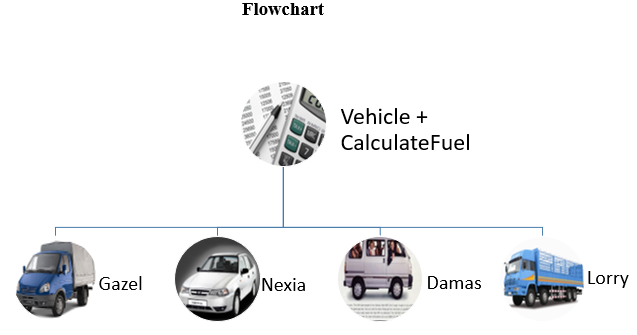

# stationery-delivery
Calculating the rerun and mileage 

## In this program, the user who calculates the rerun and mileage should enter the following:
1.	Fuel expenditure
2.	Tank volume of a particular car
3.	Price of a fuel
4.	Money spent on fuel
5.	Mileage on speedometer before and after transportation
## As an output the user gets:
1.	Fuel volume
2.	Factual mileage
3.	Mileage
4.	Rerun
5.	Extra fuel spent while transporting the goods
## Flowchart
 
